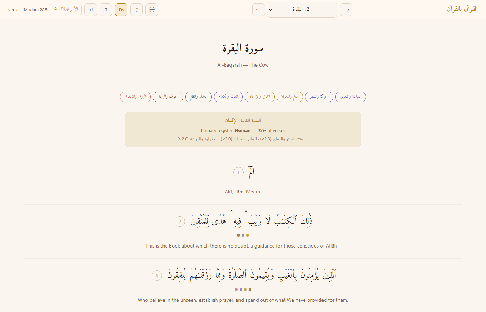
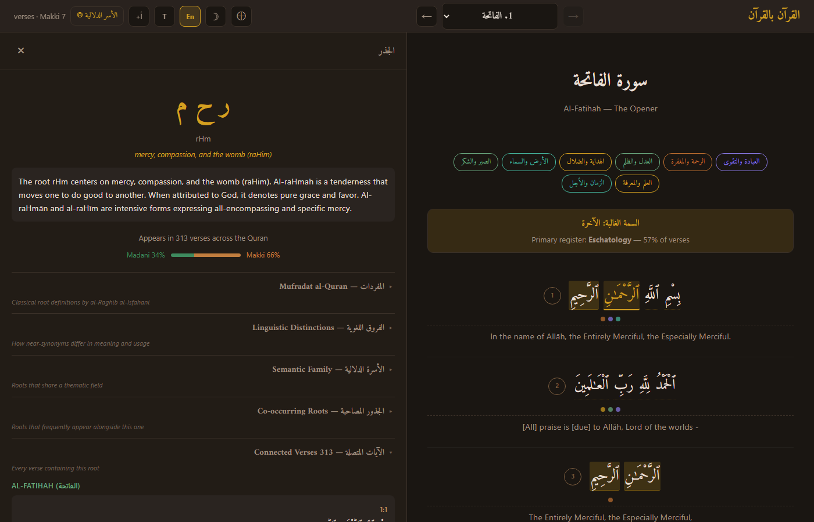
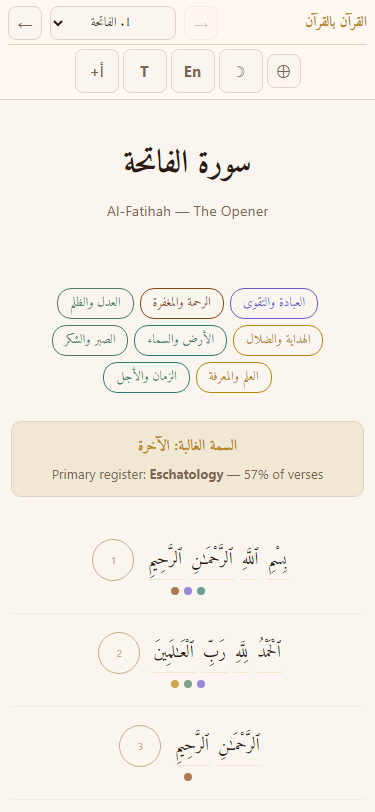
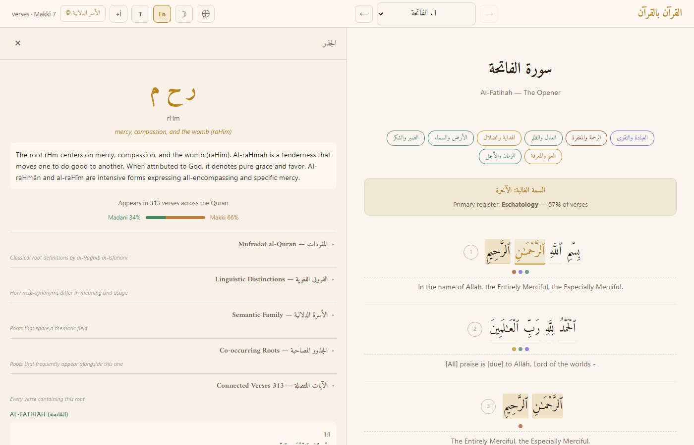
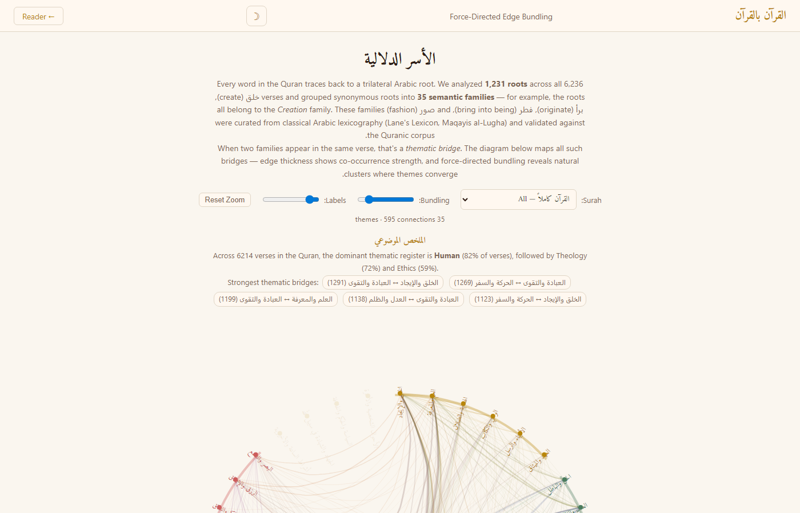

# القرآن بالقرآن — Quran bil-Quran

**Let the Quran explain itself.**

A digital Mufharis (concordance) that connects every word in the Quran to every other verse sharing its trilateral Arabic root. Where a traditional printed concordance gives you a flat alphabetical list, this tool goes further — it groups 1,651 roots into 37 semantic families, computes thematic fingerprints per surah, surfaces classical lexicography inline, and visualizes the entire root-family network as an interactive graph.

**[Live App →](https://r3genesi5.github.io/quran-bil-quran/)** · **[Dataset on HuggingFace](https://huggingface.co/datasets/iqrossed/quran-bil-quran)**



---

## Why a Concordance Matters

The Quran's primary method of self-commentary is repetition with variation. The root ر ح م (*rahima*) appears in 339 verses — as "mercy" (رحمة), "the Most Merciful" (الرحيم), "the womb" (رحم), and more. A concordance surfaces these connections instantly: click any word, and every verse sharing that root appears, grouped by surah. You see the Quran's own internal cross-references without relying on any external commentary.

This is the classical principle of **تفسير القرآن بالقرآن** — interpreting the Quran by the Quran — made navigable.

---

## What Are Semantic Families?

Arabic is built on trilateral roots. Roots that share a conceptual field — like خلق (create), برأ (originate), فطر (bring into being), صور (form) — belong to the same **semantic family** (here: "Creation"). This project defines 37 such families, curated from classical Arabic lexicography (Lane's Lexicon, Maqayis al-Lugha).

The Quran does not always unfold a concept through one repeated word. It often unfolds it through a *family of roots*. If you are studying هداية (guidance), you do not want only هدى. You also want رشد (right direction), ضلل (misguidance), صرط (path), سبل (ways) — because together they form the terrain of guidance and deviation. Semantic families let you begin from that terrain instead of discovering it manually one root at a time.

### Why families matter for study

**The problem they solve**: Quran study often breaks if you stay at the level of one English gloss. The root رحم becomes "mercy" and stays there. But the Quran builds mercy through a family — رحم (mercy), غفر (forgiveness), عفو (pardon), صفح (overlooking), حلم (forbearance), رأف (compassion). In verses like 24:22, 64:14, 2:286, and 3:159, multiple mercy-roots cluster inside one ayah. That gives you a Quran-by-Quran map of how mercy is *built* — not as one abstract noun, but as mercy, forgiveness, pardon, forbearance, and overlooking, appearing together in actual verses.

**Convergence — where families collide**: The most powerful insight comes not from individual families but from where families *intersect*. Where do justice and wealth meet? Where do revelation and speech meet? Where do mercy and punishment stand in the same verse? The densest convergence hubs in the Quran include:

| Verse | Roots | Active families | Why it matters |
|-------|-------|-----------------|----------------|
| 2:177 | 38 | 16 | The "righteousness" verse — worship, law, mercy, patience, covenant, wealth woven together |
| 2:282 | 49 | 14 | The debt verse — justice, trade, knowledge, witness, writing in one ayah |
| 73:20 | 28 | 17 | Night prayer — worship, provision, journey, warfare, mercy, forgiveness in context |
| 66:8 | 22 | 16 | Repentance — forgiveness, reward, light, guidance, family converge |

These are *junction verses* — places where the Quran weaves together what we often separate into neat compartments. A student can use them as anchor points for deep study, then fan outward through the participating roots and families.

### A study method using families

1. **Pick a family, not a verse** — start from the semantic terrain, not a single ayah
2. **Inspect the member roots** — separate near-synonyms from opposites inside the same field (e.g., هدى and ضلل both live in the Guidance family)
3. **Trace density** — find where the family becomes unusually clustered or where it converges with other families
4. **Then open tafsir** — let the text lead the inquiry first, then let tafsir refine it

This order keeps the Quran as the primary interpreter of itself. Tafsir is layered on top, not placed before the text.

### Practical applications beyond reading

- **Curriculum design** — instead of teaching "belief," "law," and "stories" as separate folders, generate study paths by family clusters and bridges. A class on repentance would branch from توب into رجع, أوب, forgiveness roots, fear/hope roots, and covenant roots where the data shows overlap
- **Memorization aid** — most people memorize by page or surah order. Families allow memorization by semantic neighborhoods, which strengthens recall through conceptual connections
- **Translation audit** — check whether one English rendering flattens distinct Arabic roots that the Quran keeps apart, or where English varies its wording while the Quran is actually repeating one root-pattern
- **Tafsir triage** — if you have limited time, you do not necessarily want the most *frequent* verses on a subject. You want the structurally *richest* ones — where two or more families meet. Those are often where the Quran gives its most complete framing
- **Claim verification** — when someone says "the Quran treats this matter only as ritual" or "only as punishment," test it against the graph. Do those verses actually co-occur with mercy, covenant, justice, or knowledge families? Often the graph shows the claim is too narrow

### How families are computed

- **Thematic fingerprinting**: Each surah gets a computed profile — Al-Baqarah is 73% Theology with distinctive spikes in Purity and Trade; Ar-Rahman is 85% Nature. Pure computation from the root graph, no AI involved
- **Cross-referencing by theme**: Click a root to see its entire family — related roots, co-occurring roots, and how often they appear together
- **Visualizing structure**: The themes page renders all 37 families as a force-directed graph where edge thickness encodes co-occurrence strength. Guidance and Revelation are tightly coupled; Animals and Trade rarely overlap

The 37 families are grouped into 6 macro-groups: Theology, Ethics, Eschatology, Nature, Human, and Society.

---

## Versions

| Version | URL | Status |
|---------|-----|--------|
| **v1.1** (current) | [r3genesi5.github.io/quran-bil-quran](https://r3genesi5.github.io/quran-bil-quran/) | Mobile-compatible layout, full feature set, actively maintained |
| **v1.0** | Same URL (previous deploy) | Desktop-optimized, header overflows on mobile screens |
| **Legacy** | [quran-bil-quran.netlify.app](https://quran-bil-quran.netlify.app) | Early version — basic reader without tafsir, search, themes, or classical lexicography |

---

## Features at a Glance

| Feature | Description |
|---------|-------------|
| **Root concordance** | Click any word → see its trilateral root, meaning, and every verse containing it |
| **Classical lexicography** | Raghib al-Isfahani's *Mufradat* (root definitions) + Abu Hilal al-Askari's *Furuq* (synonym distinctions) |
| **11 tafsir sources** | 7 Arabic, 2 Urdu, 2 English — inline expandable under each verse |
| **English translation** | Sahih International, toggleable per verse |
| **Word-by-word meanings** | Hover any word for its individual English meaning |
| **Transliteration** | Latin romanization, toggleable |
| **Semantic families** | 37 families across 6 macro-groups with per-surah thematic insights |
| **Co-occurrence analysis** | See which roots most frequently appear alongside a given root |
| **Thematic map** | D3.js force-directed edge bundling diagram of all 37 families |
| **Root search** | Find roots by Arabic, English, or Buckwalter transliteration |
| **Furuq search** | Browse linguistic distinctions between near-synonyms |
| **Dark mode** | Full dark theme, persisted across sessions |
| **Text scaling** | 4 zoom levels for Arabic text |
| **Collapsible panels** | Accordion sections for organized root information |
| **Mobile layout** | Responsive header, full-screen root panel, tuned breakpoints for phones |

| Light mode | Dark mode | Mobile |
|:---:|:---:|:---:|
|  |  |  |

---

## Offline Use

The app is a static site — HTML, CSS, JS, and JSON files. Once loaded (or cloned), most features work without internet:

**Works offline:**
- Full Quran text (Arabic) — all 114 surahs
- Root concordance — all 1,651 roots with meanings and verse lists
- Semantic families, thematic dots, and surah insights
- Mufradat and Furuq classical lexicography
- English translation and word-by-word meanings (pre-downloaded)
- Transliteration (pre-downloaded)
- Urdu tafsirs: Bayan ul-Quran and Ibn Kathir Urdu (pre-downloaded)
- Thematic map (themes.html)
- Dark mode, text scaling, search

**Requires internet:**
- Arabic tafsirs (7 sources — fetched live from quran.com API)
- English tafsirs (2 sources — fetched live from quran.com API)
- Google Fonts (Amiri) — falls back to system serif if unavailable

To run locally:
```bash
cd app && python -m http.server 8080
# Open http://localhost:8080
```

Or simply open `app/index.html` in a browser — the only limitation is that `fetch()` for JSON files requires a server (browsers block local file `fetch` due to CORS). Any static file server works.

---

## How It Works

### Reader (index.html)

1. **Read** — Browse all 114 surahs with full Uthmani Arabic text. Toggle English translation, word-by-word hover meanings, or Latin transliteration. Adjust text scale (4 levels) and switch light/dark mode
2. **Click any word** — A panel reveals the word's trilateral root, its Lane's Lexicon meaning, Raghib al-Isfahani's classical definition (*Mufradat*), synonym distinctions (*Furuq*), semantic family membership, co-occurring roots, and every verse sharing that root


3. **Search roots** — The search bar finds roots by Arabic letters, English meaning, or Buckwalter transliteration. Switch between **Roots** mode (1,651 entries) and **Furuq** mode (synonym distinctions)
4. **See the themes** — Colored dots under each verse show which of 6 macro-groups are present. A bar under each surah title shows the top semantic families and a computed thematic insight
5. **Read tafsir** — Click any verse number to expand inline tafsir. 11 sources across 3 languages, switchable via dropdown

### Thematic Map (themes.html)

A D3.js force-directed edge bundling (FDEB) diagram visualizing how the 37 semantic families connect:

- **Chord layout** — families arranged in a circle, edges encode co-occurrence strength
- **Bundling slider** — adjust edge attraction to reveal natural thematic clusters
- **Label size slider** — adjust node label readability
- **Per-surah filter** — see how family connections shift across individual surahs
- **Click-to-lock** — click a node to isolate its connections; click a connection in the detail panel to focus on a specific edge pair
- **Pan and zoom** — pinch or scroll to zoom, drag to pan



---

## Thematic Inference Pipeline

No LLM is used. All thematic analysis is pure computation from the root-family graph:

### Step 1: Build verse → family map
Each of the 1,651 roots belongs to one of 37 semantic families (via `fam` field in `roots_index.json`). At init, `buildVerseFamilies()` iterates every root, and for each verse that root appears in, adds its family to that verse's family set. Result: **6,214 of 6,236 verses (99.6%)** have at least one themed root.

### Step 2: Aggregate into 6 macro-groups
The 37 families are mapped to 6 macro-groups:

| Group | Arabic | Families |
|-------|--------|----------|
| **Theology** | الإلهيات | creation, knowledge, guidance, revelation, prophets, covenant, divine_names, lordship |
| **Ethics** | الأخلاق | patience, gratitude, repentance, righteousness, corruption, justice, charity |
| **Eschatology** | الآخرة | afterlife, reward_punishment, time, end_of_times |
| **Nature** | الطبيعة | earth_sky, water_rain, light_dark, animals |
| **Human** | الإنسان | body, speech, emotion, seeing_hearing, provision |
| **Society** | المجتمع | community, warfare, jihad, family, trade, authority, travel |

### Step 3: Compute per-surah insight
For each surah, `renderSurahInsight()`:
1. Counts **unique verses** per macro-group (using Sets to avoid double-counting)
2. Identifies the **dominant group** (highest verse coverage percentage)
3. Computes **distinctiveness** for each family: `surah_rate / quran_wide_rate`. Families with ratio > 1.5x and >= 3 occurrences are surfaced as "distinctive"

Example output for Al-Baqarah:
> **Primary register: Theology** — 73% of verses
> Distinctive: Purity (x3.6) · Trade (x3.1) · Animals (x2.4)

### Step 4: Per-verse thematic dots
Each verse gets colored dots (max 6) representing which macro-groups are present. One dot per group, auto-adapted to dark mode.

### Step 5: FDEB visualization (themes.html)
A D3.js force-directed edge bundling diagram arranges all 37 families in a circle. Edge thickness encodes co-occurrence strength. Bundling is controlled by a slider — edges attract toward nearby nodes, revealing natural clusters.

---

## Datasets

### Core Data

| File | Size | Description |
|------|------|-------------|
| `roots_index.json` | 740 KB | **1,651 roots** — Buckwalter transliteration, Lane's Lexicon meaning, frequency, verse list, semantic family |
| `families.json` | 28 KB | **37 semantic families** — groups of related roots with Arabic name and English meaning |
| `verses_text.json` | 1.4 MB | **6,236 verses** — full Uthmani Arabic text |
| `surah_list.json` | 17 KB | **114 surahs** — metadata (name, verse count, revelation type) |
| `mufradat.json` | 787 KB | **Mufradat al-Quran** — classical vocabulary (Raghib al-Isfahani) |
| `furuq.json` | 449 KB | **Furuq Lughawiyyah** — synonym distinctions (Abu Hilal al-Askari) |
| `surahs/` | 114 JSON | Word-level morphology per surah |

### Translations and Tafsir

| File | Description |
|------|-------------|
| `translations/en.sahih.json` | Sahih International English (6,236 verses) |
| `translations/wbw.en.json` | Word-by-word English meanings |
| `translations/transliteration.json` | Latin transliteration (6,236 verses) |
| `tafsirs/bayan-ul-quran/` | Bayan ul-Quran (Urdu, offline) |
| `tafsirs/ibn-kathir-ur/` | Ibn Kathir Urdu (offline) |

### HuggingFace Dataset

| Layer | File | Records |
|-------|------|---------|
| Root Graph | `roots.jsonl` | 1,651 roots with occurrences and Lane's Lexicon meanings |
| Semantic Families | `families.jsonl` | 37 families grouping synonymous roots |
| Convergence Map | `convergence.jsonl` | 6,214 verses mapped to roots and families |

---

## Tafsir Sources

Click any verse number to expand inline tafsir. 11 sources across 3 languages:

| Language | Sources | Delivery |
|----------|---------|----------|
| **Arabic** (7) | Muyassar, Ibn Kathir, Al-Sa'di, Al-Baghawi, Al-Tabari, Al-Qurtubi, Tantawi | Live API |
| **Urdu** (2) | Bayan ul-Quran, Ibn Kathir Urdu | Pre-downloaded (offline) |
| **English** (2) | Ibn Kathir English, Ma'ariful Qur'an | Live API |

Responses are cached client-side to minimize API calls.

---

## Classical Lexicography

**Mufradat al-Quran** — Raghib al-Isfahani (d. ~1108). Classical vocabulary of Quranic Arabic. Each root entry shows core meaning, semantic range, and cited verses.

**Furuq Lughawiyyah** — Abu Hilal al-Askari (d. ~1005). Treatise on near-synonym distinctions (e.g., خشية vs خوف — both mean "fear," but خشية implies awe before greatness while خوف implies apprehension of harm).

---

## Project Structure

```
src/
  quran_loader.py          # Downloads Quran text + morphology from APIs
  root_graph.py            # Builds root → verse index (digital Mufharis)
  root_families.py         # 37 semantic root families
  build_dataset.py         # Main pipeline: roots/families/convergence JSONL
  export_for_web.py        # Converts dataset to optimized JSON for web app
  download_translations.py # Fetches Sahih International + WBW from quran.com
  tafsir_fetcher.py        # Downloads complete tafsir texts from quran.com API
  parse_classical.py       # Parses Mufradat + Furuq classical sources

app/                       # Static web app (GitHub Pages)
  index.html               # Reader page
  themes.html              # FDEB chord diagram (self-contained)
  css/style.css            # Shared styles (light + dark mode)
  js/app.js                # Reader logic, thematic computation, translation
  data/
    roots_index.json       # Root glossary (1,651 roots)
    families.json          # 37 semantic families
    verses_text.json       # Full Quran text (Uthmani)
    surah_list.json        # 114 surah metadata
    mufradat.json          # Classical vocabulary (Raghib)
    furuq.json             # Synonym distinctions (Abu Hilal)
    surahs/                # Per-surah JSON (word-level morphology)
    tafsirs/               # Pre-downloaded Urdu tafsirs
    translations/          # English, WBW, transliteration
```

## Build

```bash
pip install requests tqdm huggingface_hub

python src/build_dataset.py         # Build root dataset from APIs
python src/export_for_web.py        # Export JSON for web app
python src/download_translations.py # Download English translations
python src/tafsir_fetcher.py        # Download Urdu tafsirs

cd app && python -m http.server 8080
```

## Key Stats

- **1,651** unique trilateral roots (all with Lane's Lexicon meanings)
- **6,236** verses with full Arabic text
- **44,718** total root-verse occurrences
- **37** semantic families across **6** macro-groups
- **6,214** verses (99.6%) with at least one themed root
- **11** tafsir sources in 3 languages (Arabic, Urdu, English)

## Sources

- **Verse text**: [Quran.com API](https://quran.com) — Uthmani script
- **Morphology**: [Quranic Arabic Corpus](https://github.com/mustafa0x/quran-morphology) — root/lemma/POS per word
- **Root meanings**: [Lane's Lexicon dataset](https://github.com/aliozdenisik/quran-arabic-roots-lane-lexicon)
- **Semantic families**: Curated from classical Arabic lexicography (Lane's Lexicon, Maqayis al-Lugha)
- **Mufradat**: Raghib al-Isfahani, *al-Mufradat fi Gharib al-Quran*
- **Furuq**: Abu Hilal al-Askari, *al-Furuq al-Lughawiyyah*
- **Tafsir**: [quran.com API](https://api.quran.com/api/v4) + pre-downloaded archives
- **Translation**: Sahih International + word-by-word via quran.com API

## License

MIT
